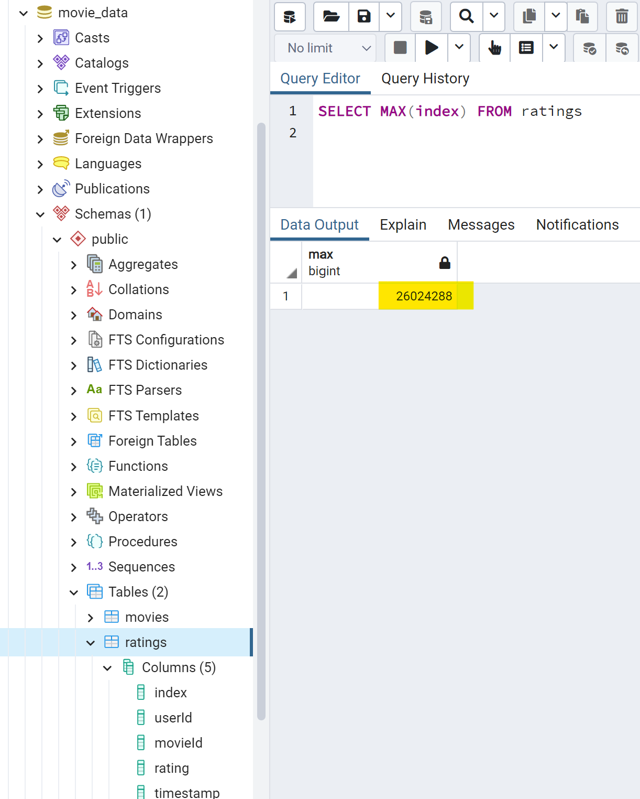

# Movies-ETL

# Module 8 Challenge

### Create an automated pipeline that takes in new data, performs the appropriate transformations, and loads the data into existing tables. Refactor the code from this module to create one function that takes in the three files—Wikipedia data, Kaggle metadata, and the MovieLens rating data—and performs the ETL process by adding the data to a PostgreSQL database.

    Deliverable 1: Write an ETL Function to Read Three Data Files
    Deliverable 2: Extract and Transform the Wikipedia Data
    Deliverable 3: Extract and Transform the Kaggle data
    Deliverable 4: Create the Movie Database

The table "movies" has 6,058 rows.

The table "ratings" has 26,024,289 rows.

